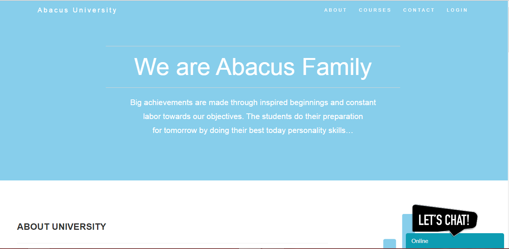

<h1>Introduction</h1>
This is Major project In this i made University admission system using Angular fronend, asp.net MVC and sql server 2012 database.
This project is for the university so that any student can apply for the admission. This also contains email, tawk.to and paypal intergrated services.
<h1>Setup and Running Project</h1>
<h4>Backend</h4>
1. Create a database using database schema file from the application. 
2. Open backend folder with visual studio and install the relavant dependencies for it. 
3. Once dependencies are done change the connection string for particular database that just created with schema file into the web.config file. 
4. Run the backend using f5 or ctrl+f5
5. It will create one URL 
<h3>
<h4>Frontend</h4>  
  1. Go to the frontend folder in a project. Install all the dependencies using (npm install). 
  2. change the URL according to the Backend URL inside the frontend application. 
  3. Run the application using (ng serve) 
  4. Your application will be ready. 
   
  It will Look Like this:
  
  
<h3>Paypal Ref :</h3>
  https://enngage.github.io/ngx-paypal/
